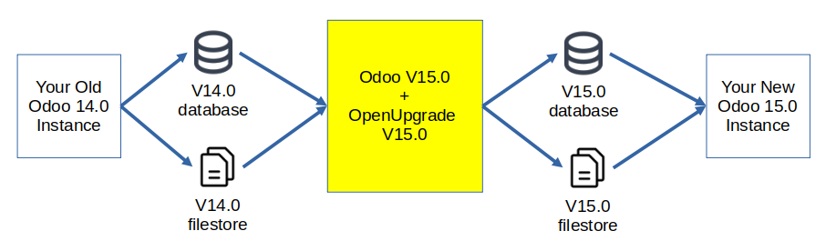
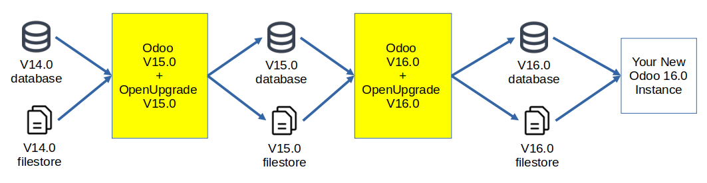

Introduction
============

What is OpenUpgrade
-------------------

Odoo is an open core business application suite and development platform.

This project, *OpenUpgrade*, aims to provide an Open Source upgrade path for
Odoo. This is a community initiative under the
`Odoo Community Association <https://odoo-community.org/>`_ umbrella, as the open source version of Odoo
Community Edition (CE) does not support migrations from one major release to another.

At present, OpenUpgrade is `the solution recommended by Fabien Pinckaers <https://www.linkedin.com/posts/damienaccorsi_opensource-odoo-odoo-activity-7059783201686212608-2U1L>`_ (CEO and Founder of Odoo S.A.) for migrating Odoo CE instances. (French-language discussion)

The project is hosted as two separate GitHub projects:

* `OpenUpgrade <https://github.com/OCA/OpenUpgrade>`_ contains:

    * the **framework** which is a set of a few Odoo patches to ensure that upgrading to a major version can be performed
    * The **database analysis** which lists the differences between one version of Odoo and the next
    * The **migration scripts** which contains database transformation scripts for each installed Odoo module.

* `openupgradelib <https://github.com/OCA/openupgradelib>`_ contains a library
  with helper functions. It can be used in the migration of any Odoo module

Note that the name of the project refers to the old name of Odoo, *OpenERP*
and that the OpenUpgrade logo includes the ant present in the *OpenERP* logo.

Migration from one version to the next
--------------------------------------

In the following, **Openupgrade X** will be understood as the tool used
to migrate a database **from version X-1 to version X**.
For example, if you want to migrate from version 14.0 to 15.0:

Migration of several versions
-----------------------------

It is perfectly possible to migrate several versions.
In this case, you'll need to perform all intermediate migrations sequentially.
For example, if you want to migrate from version 14.0 to version 16.0, you
should perform two Upgrades via OpenUpgrade 15.0, then OpenUpgrade 16.0:

Openupgrade design
------------------

* From Openupgrade 5.0 to Openupgrade 13.0, the branches
  in https://github.com/OCA/OpenUpgrade contain copies (or forks in Git terminology)
  of the Odoo main project, but with extra commits that include the framework,
  and the analysis and the migration scripts for each module.

* Since Openupgrade 14.0, the branches contain

    * a module ``openupgrade_framework`` which brings together all the patches of odoo
    * a module named ``openupgrade_scripts`` which contains analysis and migration scripts.

Why migrate to a more recent major version
------------------------------------------

* `Security holes <https://www.cvedetails.com/product/38140/Odoo-Odoo.html?vendor_id=16543>`_
  are regularly found in Odoo.
  Only the latest versions are patched, so older versions are left with security breeches that can be exploited.
  For several years now, Odoo's `policy <https://www.odoo.com/documentation/master/administration/maintain/supported_versions.html#what-s-the-support-status-of-my-odoo>`_ has been to support the latest 3 versions.

* Odoo regularly works on improving performance, so new versions are
  `much faster than older ones <https://www.youtube.com/watch?v=uDTKVD-C0eE>`_.

* Odoo is evolving very fast technically.
  As a result, some previously used technologies are now obsolete.
  (old python API, Javascript framework replaced by OWL, etc.)
  If you need to involve developers on your instance,
  it will be difficult to find someone who is competent and available
  to work on an instance of an old version.

* Odoo is becoming increasingly popular.
  As a result, more community modules are available in recent Odoo versions.
  At the same time, more and more features are available
  in the native version of odoo.

.. figure:: images/oca-modules-evolution.png

   (*Evolution of the number of OCA modules over the Odoo versions.*)

In short, not migrating your Odoo instance to a recent version means increasing
`your technical debt <https://en.wikipedia.org/wiki/Technical_debt>`_.

For more information, see `Daniel Reis' presentation <https://www.youtube.com/watch?v=u7_k8lCZeY0>`_ on the benefits of migration.

Alternative to Openupgrade
--------------------------

To migrate from one major version to another, there are alternatives to using OpenUpgrade :

1. Odoo S.A.'s service (https://upgrade.odoo.com/).
   Note that the migration scripts are **not Open Source** and
   are only available if you subscribe to Odoo Enterprise Edition.
2. Export data (products, customers) from your old instance, install Odoo in a
   recent version, and import data into the new version.
   Note that in this case, **you won't recover all the data** in your new instance,
   but only some of it. (in particular, you won't have the history and links between data,
   like the invoices for all customers for example).

To conclude, `as Richard Stallman explains <https://www.gnu.org/philosophy/when-free-depends-on-nonfree.en.html>`_,
Odoo is a software "diachronically trapped".
OpenUpgrade is the only option for keeping Odoo Open Source.
